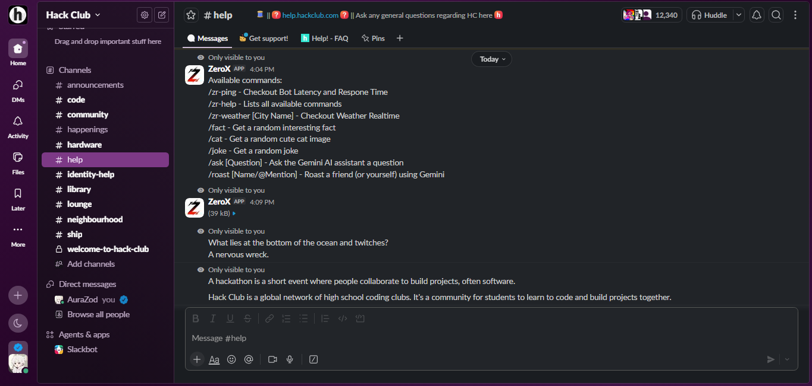

# ZeroX

A Slack app for invoking instant utilities and conversational AI directly within chat channels.




**[](https://www.youtube.com/watch?v=Kg8M_rXyJyw) [](https://app.slack.com/client/E09V59WQY1E/C0B95V123TQ)**

## What it does
* Intercepts custom slash commands like /zr-ping and /zr-fact to return responses
* Integrates AI assistant replies using the Gemini 2.5 Flash API
* Configures slash commands to run ephemerally by default, limiting noise in shared channels
* Retains a public roast command that triggers in-channel replies for group interactions

## Quick start
```bash
npm install
cp .env.example .env
```

Update `.env` file to Contain credentials of app

```bash
npm run dev
```

## Running locally
Requires `Node.js v24.11.1.`

Set up :
- SLACK_BOTTOKEN
- SLACK_APPTOKEN
- GEMINI_API
- WEATHER_API
- CAT_API

variables in a local .env file. Run `npm install` and start the bot with `npm run dev`.

## How it works
ZeroX uses Slack Socket Mode to establish a persistent WebSocket connection, bypassing public HTTP route exposure. A centralized router wraps the event context to intercept standard channel logging and direct output ephemerally or publicly based on the command registry. I have worked on creating multiple apps on Discord in Python, but this was my first experience developing a Slack bot in JavaScript. The implementation is currently rough and needs touches in many places, but I am glad to have worked on it and will continue to build on it if I find a better response.

## Credits 
Built using the Slack Bolt JS framework.

## Ai Usage 
For summarizing and understanding Api & websocket usage in slack bots & understanding Bolt JS framework for building bot.